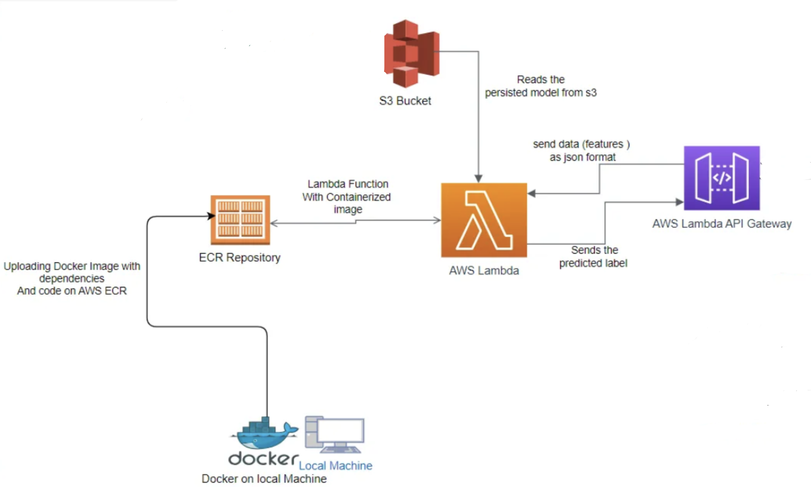
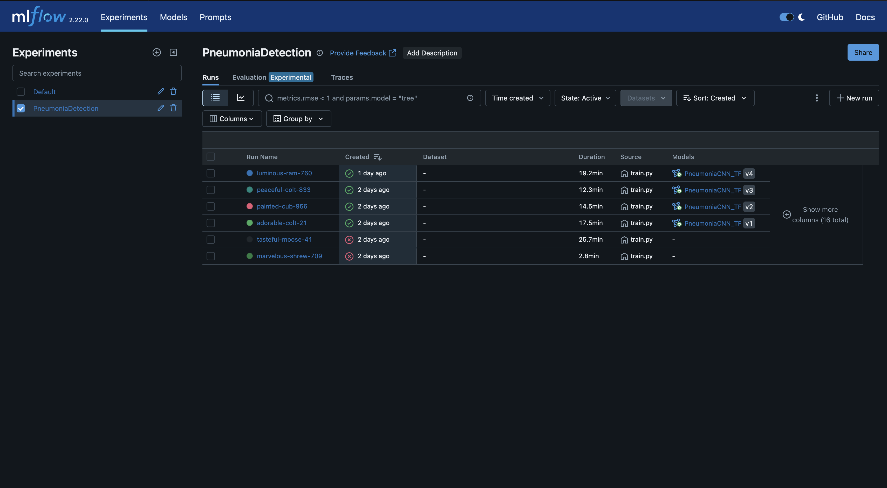
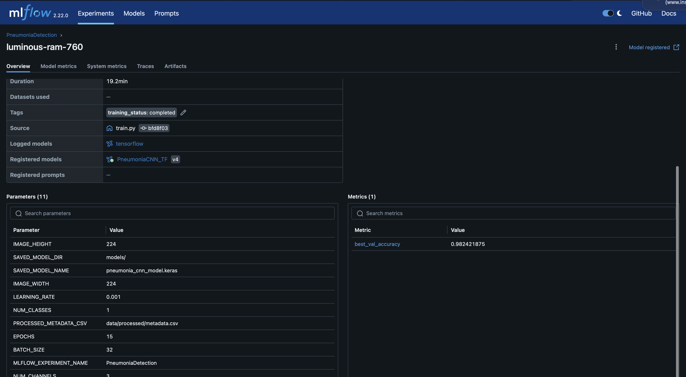

# Pneumonia Detection from X-rays: An End-to-End MLOps Project

## Overview
This project demonstrates a comprehensive MLOps pipeline for detecting pneumonia from chest X-ray images. It covers data ingestion and versioning, preprocessing, model training and experimentation, model conversion for optimized inference, deployment as a serverless API, and CI/CD automation.




## Features & MLOps Aspects Covered
* **Data Ingestion & Versioning:** Using DVC to version control the dataset (stored on AWS S3).
* **Data Preprocessing:** Standard image preparation techniques.
* **Model Development:** CNN model built with TensorFlow/Keras.
* **Experiment Tracking:** Leveraging MLflow for tracking training parameters, metrics, and models.
* **GPU Accelerated Training (Local):** Utilized Apple Silicon (M-series) MPS for faster local model training.
* **Model Conversion:** Converting the trained Keras model to ONNX for optimized and interoperable inference.
* **Containerization:** Packaging the inference application using Docker.
* **Cloud Deployment (Serverless):**
    * Model served via AWS Lambda (using a container image from Amazon ECR).
    * API endpoint exposed using Amazon API Gateway.
    * Demonstrated troubleshooting for native library compatibility (ONNX Runtime) by switching from ARM64 to x86_64 Lambda architecture for deployment.
* **CI/CD Automation:** Basic CI/CD pipeline using GitHub Actions to build the Docker image, push to ECR, and update the Lambda function.

## Results Highlights
* The trained CNN model achieved a validation accuracy of approximately **98.3%** for pneumonia detection.
* Successfully deployed as a scalable, serverless API endpoint.





## Directory Structure

```text

pneumonia-detection-mlops/
├── .dvc/                   # DVC internal files (cache config, etc.) - gitignored by DVC itself except for config
├── .github/
│   └── workflows/
│       └── deploy_lambda.yml # GitHub Actions CI/CD workflow for Lambda deployment
├── app_lambda/             # Code and Docker configuration for the AWS Lambda function
│   ├── Dockerfile          # Dockerfile to build the Lambda container image
│   ├── app.py              # Python script with the Lambda handler logic
│   └── requirements_lambda.txt # Python dependencies for the Lambda function
├── config/
│   └── params.yaml         # Configuration parameters (image size, batch size, paths, etc.)
├── images/
│   └── highlevelarch.png
│   └── mlflow1.png
│   └── mlflow2.png
├── data/                   # Project data - actual large files are tracked by DVC, not Git
│   ├── processed/
│   │   └── metadata.csv    # CSV with filepaths, labels, splits (generated by preprocessing)
│   │                       # (Actual metadata.csv is gitignored if data/processed/ is)
│   ├── raw/
│   │   └── chest_xray/     # Raw chest X-ray images (train, test, val subfolders)
│   │                       # (Actual image files are gitignored if data/raw/ is)
│   ├── data/processed/.gitignore # DVC adds this to ignore actual files in data/processed/
│   ├── data/raw/.gitignore     # DVC adds this to ignore actual files in data/raw/
│   ├── processed/metadata.csv.dvc # DVC pointer file for metadata.csv
│   └── raw.dvc                 # DVC pointer file for the entire data/raw/ directory
├── models/                 # Trained models and converted models
│   ├── pneumonia_cnn_model_YOUR_RUN_ID.keras # Example trained Keras model (tracked by DVC)
│   ├── pneumonia_cnn_model_YOUR_RUN_ID.keras.dvc # DVC pointer for the Keras model
│   ├── pneumonia_model.onnx    # ONNX version of the model (tracked by DVC)
│   ├── pneumonia_model.onnx.dvc # DVC pointer for the ONNX model
│   └── .gitignore              # DVC might add this to ignore actual model files
├── notebooks/              # Jupyter notebooks for exploration and experimentation
│   ├── 01_data_exploration_and_preprocessing.ipynb
│   ├── 02_model_training_and_experimentation.ipynb
│   └── .ipynb_checkpoints/   # Jupyter auto-generated checkpoints - gitignored
├── scripts/                # Utility scripts
│   └── convert_to_onnx.py  # Script to convert Keras model to ONNX
│   #└── download_dataset.sh # Optional: Script for initial data download
├── src/                    # Source code for the ML pipeline
│   ├── init.py
│   ├── data_ingestion.py   # Scripts for initial data download/setup (if not using shell script)
│   ├── data_loader.py      # Custom Keras data generator
│   ├── data_preprocessing.py # Image preprocessing logic
│   ├── model_builder.py    # CNN model definition
│   ├── predict_local.py    # Script for local ONNX model prediction test
│   ├── train.py            # Model training script
│   └── utils.py            # Utility functions (if any)
├── tests/                  # Placeholder for unit and integration tests
│   ├── init.py
│   └── test_data_preprocessing.py # Example test file
├── .gitignore              # Specifies intentionally untracked files for Git
├── LICENSE                 # Project license file
├── README.md               # This file: project overview, setup, usage
├── requirements.txt        # Python dependencies for local development and training
└── mlruns/                 # MLflow experiment tracking data - gitignored

```


## Setup and Installation

### Prerequisites
* Python (3.9+ recommended for local, 3.11 used in Lambda container)
* Git
* DVC (`pip install dvc[s3]`)
* Docker Desktop
* AWS CLI (configured with necessary permissions)
* MLflow (`pip install mlflow`)

### Installation Steps
1.  **Clone the repository:**
    ```bash
    git clone [https://github.com/your-username/pneumonia-detection-mlops.git](https://github.com/your-username/pneumonia-detection-mlops.git)
    cd pneumonia-detection-mlops
    ```
2.  **Set up Python virtual environment:**
    ```bash
    python3 -m venv venv
    source venv/bin/activate
    pip install -r requirements.txt
    ```
3.  **Pull DVC-tracked data and models:**
    *(Ensure your AWS credentials are set up for DVC to access the S3 remote)*
    ```bash
    dvc pull
    ```
4.  **(Optional) MLflow UI:**
    To view experiment tracking results:
    ```bash
    mlflow ui
    ```
    Then open `http://127.0.0.1:5000` in your browser.

## How to Run the Pipeline Stages Manually

1.  **Data Ingestion (if not pulled via DVC):**
    *(Describe how to get the raw data if `dvc pull data/raw` isn't the primary method or if initial setup is needed)*
    ```bash
    # Example: python src/data_ingestion.py
    ```
2.  **Data Preprocessing:**
    *(Generates `data/processed/metadata.csv`)*
    ```bash
    python src/data_preprocessing.py
    ```
3.  **Model Training:**
    *(Ensure `config/params.yaml` is set. Generates a `.keras` model in `models/` and logs to MLflow)*
    ```bash
    python src/train.py
    ```
4.  **ONNX Conversion:**
    *(Update `scripts/convert_to_onnx.py` with the correct trained Keras model filename)*
    ```bash
    python scripts/convert_to_onnx.py
    ```
5.  **Local ONNX Prediction Test:**
    *(Update `src/predict_local.py` with a sample image path)*
    ```bash
    python src/predict_local.py
    ```

## Deployment Details
The inference service is deployed on AWS Lambda using a container image stored in ECR, fronted by API Gateway.

* **Lambda Function:** `PneumoniaDetectionFunction` (x86_64 architecture, Python 3.11 via container)
* **API Endpoint Invoke URL (Example from `dev` stage):**
    `https://YOUR_API_ID.execute-api.YOUR_AWS_REGION.amazonaws.com/dev/predict`
* **Example API Call (`curl`):**
    ```bash
    # First, get a base64 encoded image string:
    # base64 -i path/to/your/test_image.jpeg | pbcopy (on macOS to copy to clipboard)
    export BASE64_IMAGE_STRING="YOUR_COPIED_BASE64_STRING"

    curl -X POST \
    'https://YOUR_API_ID.execute-api.YOUR_AWS_[REGION.amazonaws.com/dev/predict](https://REGION.amazonaws.com/dev/predict)' \
    -H 'Content-Type: application/json' \
    -d "{\"image\": \"${BASE64_IMAGE_STRING}\"}"
    ```
    **Expected Response:**
    ```json
    {
        "predicted_label": "NORMAL", // or "PNEUMONIA"
        "probability_pneumonia": 0.12345,
        "modelVersion": "lambda_models/pneumonia_model.onnx"
    }
    ```

## CI/CD Pipeline (GitHub Actions)
A basic CI/CD pipeline is set up using GitHub Actions (`.github/workflows/deploy_lambda.yml`):
* On push to the `main` branch:
    1.  Builds the Docker image for the Lambda function.
    2.  Pushes the image to Amazon ECR.
    3.  Updates the AWS Lambda function to use the new image.

## Future Improvements
* Implement comprehensive unit and integration tests.
* Define infrastructure using AWS SAM or Terraform (Infrastructure as Code).
* Set up advanced monitoring, logging, and alerting for the API endpoint and model performance.
* Automate the model retraining pipeline based on new data or performance degradation.
* Incorporate data augmentation during training.
* Explore ONNX Runtime optimizations (quantization, different EPs) or other inference runtimes like OpenVINO/TensorRT.
* Re-evaluate ARM64 for Lambda deployment if ONNX Runtime/Lambda ARM environment improves.

## License
(Specify your chosen license, e.g., MIT License)